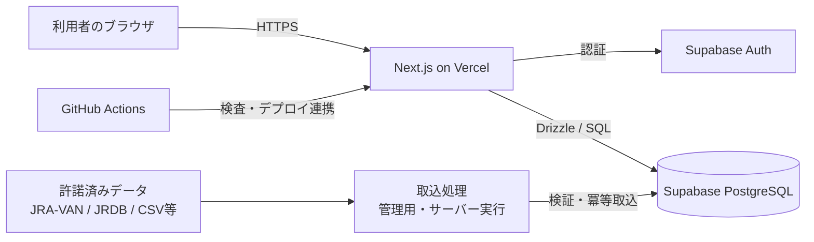
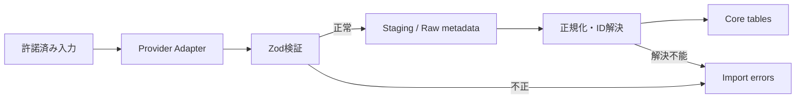
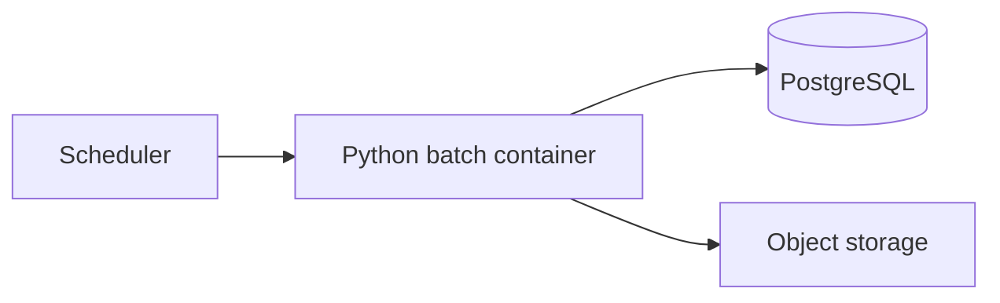

# アーキテクチャ設計

> この文書はPhase0/Phase1開始時点のアーキテクチャ方針です。現在はPhase3まで進んでおり、実装済み機能の一覧は [PROJECT_STATUS.md](./PROJECT_STATUS.md) を参照してください。

## 1. 文書の目的

本書は、Phase 1の論理構成、責務分離、データフロー、セキュリティ、および将来の拡張・移行方針を定義する。

## 2. 採用構成

- Frontend / API: Next.js + TypeScript
- Hosting: Vercel
- Database: Supabase PostgreSQL
- Authentication: Supabase Auth
- ORM: Drizzle ORM
- Validation: Zod
- CI: GitHub Actions

Phase 1では、少数の管理サービスを組み合わせ、個人開発で維持できる運用負荷に抑える。

## 3. 論理構成



クライアントから競馬データ用DBへの自由な直接アクセスは許可しない。主要な読取・更新はNext.jsのサーバー境界を通し、認証・認可・入力検証を行う。

## 4. レイヤーと責務

推奨する依存方向は次のとおりとする。

```text
UI
  ↓
Application / Use Cases
  ↓
Domain
  ↓
Infrastructure
```

### UI

- Next.jsのページ、レイアウト、コンポーネント
- 表示、入力、アクセシビリティ
- サーバーから受け取ったデータの描画
- 業務ルールやSQLを持たない

### Application / Use Cases

- レース一覧取得、メモ保存、CSV取込などのユースケース
- 認可
- トランザクション境界
- DomainとInfrastructureの調整
- APIレスポンスへの変換

### Domain

- レース、出走、結果、ユーザーメモなどの概念
- 状態遷移と不変条件
- データ提供元やSupabaseに依存しないルール

### Infrastructure

- DrizzleによるDBアクセス
- Supabase Authとの連携
- データ提供元ごとのパーサー
- ログ、監視、外部ストレージ

## 5. Next.jsの責務

### Server Components

- 初期表示に必要なデータ取得
- 秘密情報を必要とする処理
- SEOが必要な公開情報のレンダリング

### Route Handlers / Server Actions

- 入力のZod検証
- 認証・認可
- 更新処理
- 管理用取込の起動
- 外部へ公開するAPI境界

更新系処理は、呼出元が画面であってもサーバー側で再度検証する。

### Client Components

- ユーザー操作が必要なUI
- ローカル状態
- サーバーが返した安全な情報の表示

Service Role Key、DB接続文字列、データ提供元の認証情報をClient Componentへ渡してはならない。

## 6. 認証・認可

### 認証

Supabase Authを認証プロバイダーとして利用する。セッションはSupabaseのNext.js向け推奨方式に従い、サーバー側で検証する。

### アプリケーションユーザー

Supabase Authの`auth.users.id`を外部認証IDとして扱い、アプリケーション側には独立した`app_users`を設ける。

```text
Supabase Auth user
        │ external_auth_id
        ▼
app_users
        │
        ├── user_favorites
        └── user_notes
```

この分離により、認証基盤を変更しても業務データの主キーを維持できる。

### 認可

- 公開可能な競馬データは読取専用とする。
- ユーザー固有データは所有者だけが読取・更新できる。
- 管理用取込は管理権限を持つサーバー処理だけが実行できる。
- 管理者判定をクライアントから送られた値に依存させない。
- RLSを利用するテーブルは、許可・拒否の両方を自動テストする。

## 7. データ取込アーキテクチャ

取込処理は、提供元固有処理と共通の業務データ反映を分離する。



### Provider Adapter

- 提供元ごとの項目名、コード、ファイル形式を吸収する。
- 提供元の外部IDを保持する。
- 共通の内部モデルへ変換する。
- 契約上保存できない原データを無条件に永続化しない。

### 検証

検証は少なくとも二段階で行う。

1. 形式検証: 型、必須項目、文字コード、日付形式
2. 業務検証: ID対応、開催・レース整合性、値域、状態遷移

### 冪等性

- `provider_id + entity_type + external_id`などの一意キーで外部レコードを識別する。
- 同じ入力を再処理しても意図しない重複を作らない。
- 取込バッチ単位で成功、部分成功、失敗を記録する。
- 訂正値は履歴を追跡できる形で反映する。

### 時刻

- `available_at`: その情報が利用可能になった時刻
- `observed_at`: システムまたは提供元で値を観測した時刻
- `imported_at`: 本DBへ取り込んだ時刻

3つを同一視しない。提供元仕様により取得不能な時刻は、推測値であることが分かるように根拠と精度を管理する。

## 8. API設計方針

- APIの入力と出力をZodスキーマで定義する。
- DB行を無加工でクライアントへ返さない。
- 内部ID、外部ID、出典情報の公開範囲を用途ごとに決める。
- 日付・時刻のタイムゾーンを明確にする。
- 一覧APIはページネーションを必須とする。
- エラー形式を統一する。
- 更新APIには認証、認可、CSRFを含む脅威への対策を行う。
- 公開API化はPhase 1の必須要件としない。

## 9. DB接続方針

- Drizzle ORMを主要なアクセス手段とする。
- マイグレーションをGitで管理し、本番DBの手動変更を避ける。
- Vercelからの接続は、Supabaseが提供する適切なPoolerまたはサーバーレス対応接続方式を利用する。
- トランザクションが必要な処理は、Poolerのモードと互換性を確認する。
- DB接続文字列はサーバー専用環境変数として管理する。
- 本番、プレビュー、ローカルでDBを分離し、本番データを開発に複製しない。

## 10. キャッシュ方針

- 初期段階では、正確性を優先してキャッシュ範囲を限定する。
- レース結果やオッズなど更新頻度が異なるデータを同じキャッシュ期間にしない。
- 速報・確定状態の変更時に再検証できる設計にする。
- ユーザー固有データを共有キャッシュへ保存しない。
- キャッシュを正本としない。

## 11. ログ・監視

### ログに含めるもの

- リクエストまたは処理の相関ID
- 取込バッチID
- データ提供元ID
- 処理件数、成功件数、失敗件数
- エラー種別
- 実行時間

### ログに含めないもの

- パスワード
- セッショントークン
- Service Role Key
- DB接続文字列
- データ提供元の秘密情報
- 不要な個人情報
- 契約上ログ保存が許可されない原データ

### 監視対象

- Webエラー率
- レスポンスタイム
- DB接続エラー
- 取込遅延
- 取込失敗率
- データ更新停止
- ストレージ・DB容量
- サービス利用料金

## 12. CI方針

GitHub Actionsで、少なくとも以下を実行する。

- 依存関係の再現可能なインストール
- Formatチェック
- Lint
- TypeScript型チェック
- 単体テスト
- DB関連テスト
- マイグレーション整合性確認
- ビルド
- シークレットや依存関係の基本的なセキュリティ検査

本番マイグレーションは、バックアップ、互換性、ロールバック方針を確認したうえで実行する。

## 13. 環境分離

| 環境 | 用途 | データ |
| --- | --- | --- |
| Local | 個人開発 | 合成データまたは許諾済み最小データ |
| Preview / Staging | PR確認、結合試験 | 匿名化・合成した検証データ |
| Production | 利用者向け | 契約範囲内の本番データ |

本番の認証キー、DB、データ提供元認証情報をPreview環境で共有しない。

## 14. PostgreSQL移行性

RDS PostgreSQLへの移行を容易にするため、次を守る。

- PostgreSQL標準の型、制約、インデックスを優先する。
- Supabase固有スキーマへの直接依存を認証連携箇所に限定する。
- 業務テーブルの主キーにSupabase Auth IDを使用しない。
- RLSを使用する場合、アプリケーション側認可でも代替できるよう責務を整理する。
- 拡張機能を追加するときは、RDSでの提供状況を確認する。
- DB関数・トリガーは必要最小限とし、目的と移行方法を文書化する。
- Storage、Realtime、Edge Functionsへの依存はアダプター境界の内側に置く。
- 定期的に標準PostgreSQLへのスキーマ適用テストを検討する。

## 15. 将来のPython処理

PythonバッチはNext.jsから分離した実行単位とする。



- コンテナ化し、ECSまたはCloud Runへ移せるようにする。
- DBスキーマを共有しつつ、専用の最小権限DBロールを使用する。
- Phase 1ではAI、特徴量、ペース、位置取りの処理を実装しない。
- 将来の分析テーブルは業務系テーブルから分離する。

## 16. 主なアーキテクチャ判断

| 判断 | 理由 |
| --- | --- |
| モジュラーモノリスから開始 | 個人開発での速度と保守性を優先するため |
| Next.jsをUIとAPIに利用 | デプロイ対象を減らし、型を共有するため |
| PostgreSQLを正本とする | 関係データ、整合性、将来の分析・移行に適するため |
| 取込をアダプター化 | 提供元変更と契約差を中核モデルから隔離するため |
| AI基盤を後回しにする | まずデータ品質と時点整合性を確立するため |
| Supabase依存を境界化 | RDS PostgreSQLへの移行余地を残すため |

## 17. 未決定事項

- Phase 1で最初に対応するデータ提供元
- 各提供元の保存・表示・商用利用可能範囲
- CSVアップロードを管理画面で行うか、管理CLI・ジョブで行うか
- 公開情報とログイン必須情報の境界
- お気に入り・メモ以外の初期ユーザー機能
- 監視サービス
- バックアップ保持期間
- 本番リージョン

未決定事項は実装開始前または該当機能着手前にIssue化する。
