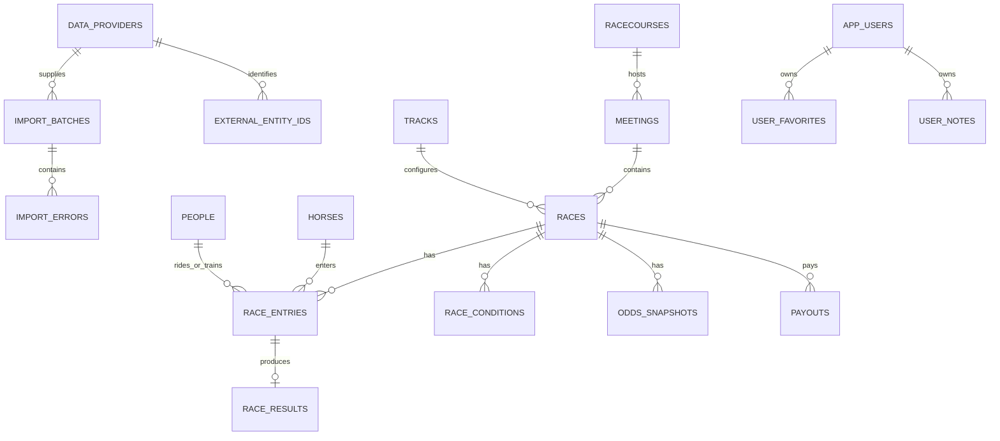

# データベース設計方針

> この文書は初期DB設計方針です。現在はPhase3で `feature_*`、`prediction_*` 系テーブルも実装済みです。現在の実装状態は [PROJECT_STATUS.md](./PROJECT_STATUS.md) を参照してください。

## 1. 文書の目的

本書は、Supabase PostgreSQL上に構築するPhase 1のデータモデル、命名、時点管理、取込、認証連携、およびAWS RDS PostgreSQLへの移行性を定義する。

本書は論理設計であり、実際のDDLは実装フェーズでDrizzleのスキーマとマイグレーションとして作成する。

## 2. 設計原則

- PostgreSQLをデータの正本とする。
- 業務データは原則として正規化する。
- 外部データ提供元のIDを内部主キーにしない。
- データ提供元と外部IDの対応を明示的に管理する。
- 取込は冪等にする。
- 速報、確定、訂正、取消を区別する。
- 履歴が必要な情報を単純な上書きだけで失わない。
- `available_at`、`observed_at`、`imported_at`を区別する。
- 日時は原則`timestamp with time zone`でUTC保存する。
- 日本の開催日など業務上の日付は`date`として別に保持する。
- DB制約で表現できる整合性はDBでも保証する。
- JSONBを主要な業務モデルの代わりに使用しない。
- Supabase固有機能への依存を限定する。

## 3. スキーマ構成

| スキーマ | 目的 | Phase 1 |
| --- | --- | --- |
| `app` | ユーザー、権限、お気に入り、メモ | 使用 |
| `core` | 競馬場、馬、人物、レース、出走、結果 | 使用 |
| `ingestion` | 提供元、外部ID、取込バッチ、エラー | 使用 |
| `staging` | 検証・正規化前の一時データ | 必要に応じて使用 |
| `analytics` | 特徴量、集計スナップショット | Phase 3以降 |
| `prediction` | モデル、予測、評価 | Phase 4以降 |

`analytics`と`prediction`は将来用の責務名であり、Phase 1ではテーブルを先行作成しない。

## 4. 共通カラム

業務テーブルでは必要に応じて以下を使用する。

| カラム | 型の例 | 用途 |
| --- | --- | --- |
| `id` | `uuid`または`bigint` | 内部主キー |
| `created_at` | `timestamptz` | DBレコード作成時刻 |
| `updated_at` | `timestamptz` | DBレコード更新時刻 |
| `available_at` | `timestamptz` | 情報が利用可能になった時刻 |
| `observed_at` | `timestamptz` | 値を観測した時刻 |
| `imported_at` | `timestamptz` | 本DBに取り込んだ時刻 |
| `source_updated_at` | `timestamptz` | 提供元が示す更新時刻 |
| `status` | enum相当または参照コード | 速報、確定、取消など |

### 時刻の定義

#### `available_at`

利用者または処理が、その情報を知り得るようになった時刻。将来の学習・バックテストで、情報を使ってよいか判断する基準となる。

#### `observed_at`

提供元のフィード、ファイル、画面以外の正規手段などで、その値をシステムが観測した時刻。取得処理開始時刻と終了時刻が重要な場合は別途保存する。

#### `imported_at`

本システムのPostgreSQLに反映された時刻。システム遅延や再取込の追跡に使用する。

### 時刻に関するルール

- `imported_at`を`available_at`の代用にしない。
- 提供元から取得できない時刻を事実として捏造しない。
- 推定した`available_at`を使用する場合は、推定方法や精度を別カラムまたはメタデータで示す。
- 将来の学習データ抽出では、基準時刻以下の`available_at`を持つ情報だけを使用する。
- 時刻不明の情報を学習へ含める場合は、明示的な除外・採用ルールを設ける。

## 5. 内部IDと外部ID

内部エンティティは提供元に依存しない主キーを持つ。提供元のIDは`ingestion.external_entity_ids`で対応付ける。

### `ingestion.data_providers`

| カラム | 説明 |
| --- | --- |
| `id` | 内部ID |
| `code` | `jra_van`、`jrdb`、`csv_xxx`などの一意コード |
| `name` | 表示名 |
| `terms_version` | 確認した契約・規約の版 |
| `commercial_use_allowed` | 契約確認結果 |
| `retention_policy` | 保存期間に関するメモ |
| `enabled` | 取込可否 |

契約条件の全文や秘密情報をDBへ無造作に保存しない。法務・契約台帳への参照を持たせる設計も検討する。

### `ingestion.external_entity_ids`

| カラム | 説明 |
| --- | --- |
| `provider_id` | 提供元 |
| `entity_type` | horse、jockey、raceなど |
| `external_id` | 提供元のID |
| `internal_id` | アプリ内ID |
| `valid_from` / `valid_to` | 対応関係の有効期間が必要な場合 |
| `created_at` | 作成時刻 |

`provider_id + entity_type + external_id`に一意制約を設ける。

複数エンティティを単一テーブルで参照する方式は外部キーを張りにくいため、実装時にエンティティ別マッピングテーブルとの比較を行う。整合性を優先する場合は、`horse_external_ids`などへ分割する。

## 6. Phase 1の主要テーブル

### 6.1 競馬マスタ

#### `core.racecourses`

- 競馬場
- 競馬場コード、名称、国・地域
- 中央・地方などの主催区分が必要な場合は明示する

#### `core.tracks`

- 競馬場内のコース条件
- 芝・ダート・障害
- 内外回り、距離、方向など

#### `core.horses`

- 競走馬の基本情報
- 馬名、生年月日、性別、毛色など、利用許諾された項目
- 同名や改名を考慮し、名前を主キーにしない

#### `core.people`

- 騎手、調教師など人物の共通情報
- 氏名を主キーにしない

役割差が大きくなった場合は、`jockeys`、`trainers`へ分割する。Phase 1実装時に提供データの形を確認して決定する。

#### `core.owners` / `core.breeders`

- 馬主、生産者
- 契約上表示・保存可能な場合のみ作成する

### 6.2 開催・レース

#### `core.meetings`

- 開催単位
- 競馬場、開催年、回、日、開催日
- 提供元によって開催の表現が異なるため、外部コードと分離する

#### `core.races`

| 主なカラム | 説明 |
| --- | --- |
| `id` | 内部レースID |
| `meeting_id` | 開催 |
| `race_number` | レース番号 |
| `name` | レース名 |
| `scheduled_start_at` | 発走予定時刻 |
| `actual_start_at` | 実発走時刻、取得可能な場合 |
| `track_id` | コース条件 |
| `distance_meters` | 距離 |
| `grade_code` | グレード等 |
| `race_status` | 予定、確定、取消、中止等 |
| `available_at` | レース情報が利用可能になった時刻 |
| `observed_at` | 観測時刻 |
| `imported_at` | 取込時刻 |

`meeting_id + race_number`など、業務上一意となる組み合わせに一意制約を検討する。

#### `core.race_conditions`

- 天候
- 馬場状態
- 状態が変化する場合の履歴
- `effective_at`または`observed_at`

レース行を上書きするだけでは過去時点の状態を失うため、更新履歴が必要な情報は別テーブルにする。

### 6.3 出走

#### `core.race_entries`

レースと競走馬の中間エンティティであり、出走単位で変化する情報を保持する。

| 主なカラム | 説明 |
| --- | --- |
| `id` | 内部出走ID |
| `race_id` | レース |
| `horse_id` | 競走馬 |
| `frame_number` | 枠番 |
| `horse_number` | 馬番 |
| `jockey_id` | 騎手 |
| `trainer_id` | 調教師 |
| `assigned_weight` | 斤量 |
| `body_weight` | 馬体重、取得・表示可能な場合 |
| `body_weight_diff` | 増減 |
| `entry_status` | 登録、出走、取消、除外等 |
| `available_at` | 出走情報の利用可能時刻 |
| `observed_at` | 観測時刻 |
| `imported_at` | 取込時刻 |

- `race_id + horse_id`に一意制約を設ける。
- 馬番確定前など段階的に情報が追加されることを考慮する。
- 騎手変更、馬体重発表、出走取消を追跡する必要がある場合は履歴テーブルを追加する。

### 6.4 結果

#### `core.race_results`

| 主なカラム | 説明 |
| --- | --- |
| `race_entry_id` | 出走 |
| `finish_position` | 着順。中止・失格等を別状態で表現 |
| `finish_status` | 完走、中止、失格、取消等 |
| `finish_time` | 走破時計 |
| `margin` | 着差。構造化方法は提供仕様に合わせる |
| `final_odds` | 最終オッズ。許諾範囲内の場合 |
| `result_status` | 速報、確定、訂正 |
| `available_at` | 結果利用可能時刻 |
| `observed_at` | 観測時刻 |
| `imported_at` | 取込時刻 |

着順を単純な必須整数にすると、同着、失格、中止、取消を正しく表現できない。着順と状態を分離する。

#### `core.payouts`

- レース
- 式別
- 的中組番
- 払戻金
- 人気
- 確定・訂正状態
- 各種時刻

金額は浮動小数点ではなく整数で保存する。

### 6.5 オッズ

#### `core.odds_snapshots`

- レースまたは買い目
- 式別
- 組番
- オッズ
- `available_at`
- `observed_at`
- `imported_at`
- 提供元

オッズは大量になるため、他のレース情報と分離する。

- オッズには`numeric`を使用し、浮動小数点誤差を避ける。
- 同一観測を識別する一意キーを検討する。
- 取得頻度と保存期間はデータ契約に従う。
- データ量増加時は開催日または観測日によるパーティションを検討する。
- Phase 1で必要性が低い場合は、最終オッズのみから開始する。

### 6.6 ユーザー

#### `app.app_users`

| 主なカラム | 説明 |
| --- | --- |
| `id` | アプリ内ユーザーID |
| `external_auth_id` | Supabase AuthのユーザーID |
| `display_name` | 表示名 |
| `created_at` | 作成時刻 |
| `updated_at` | 更新時刻 |

`external_auth_id`には一意制約を設ける。業務テーブルは原則`app_users.id`を参照する。

#### `app.user_favorites`

- ユーザー
- 対象種別
- 対象ID
- 作成時刻

ポリモーフィック参照は外部キー整合性が弱くなるため、`favorite_horses`、`favorite_races`などへの分割を優先検討する。

#### `app.user_notes`

- ユーザー
- 対象
- 本文
- 作成・更新時刻

ユーザー入力は表示時に適切にエスケープし、サイズ上限を設ける。

## 7. 取込管理テーブル

### `ingestion.import_batches`

| カラム | 説明 |
| --- | --- |
| `id` | バッチID |
| `provider_id` | 提供元 |
| `source_type` | API、CSV、手動アップロードなど |
| `source_reference` | ファイル名や提供元処理ID。秘密情報は含めない |
| `status` | pending、running、partial、succeeded、failed |
| `started_at` | 開始時刻 |
| `finished_at` | 終了時刻 |
| `total_count` | 対象件数 |
| `success_count` | 成功件数 |
| `failure_count` | 失敗件数 |
| `checksum` | 同一入力検出用 |
| `created_by` | 実行者またはシステム |

### `ingestion.import_errors`

- バッチID
- 行番号または外部レコード参照
- エラーコード
- 安全なエラー内容
- 再処理状態
- 発生時刻

契約上保存不可の原データや秘密情報をエラー内容へ含めない。

### `ingestion.source_record_versions`

訂正履歴や原データとの対応が必要な場合に使用する。

- 提供元
- エンティティ種別
- 外部ID
- バージョンまたはチェックサム
- `available_at`
- `observed_at`
- `imported_at`
- 取込バッチID
- 保存が許可される範囲のメタデータ

原ペイロードの保存は必須ではない。利用契約、容量、個人情報、再現性を確認して決める。

## 8. 概念ER図

実装時の物理ER図では、騎手・調教師の参照やお気に入り対象を外部キーで正確に表現する。

## 9. 制約とインデックス

### 制約

- 外部キーを原則として設定する。
- 業務上一意な組み合わせに一意制約を設定する。
- 馬番、枠番、距離、オッズ、金額などに妥当なCHECK制約を設定する。
- 状態値は、変更頻度に応じてCHECK制約、PostgreSQL enum、参照テーブルから選ぶ。

移行のしやすさと変更容易性を考慮し、頻繁に増減する業務コードへPostgreSQL enumを乱用しない。

### 初期インデックス候補

- `races(meeting_id, race_number)`
- `races(scheduled_start_at)`
- `race_entries(race_id, horse_number)`
- `race_entries(horse_id, race_id)`
- `race_results(race_entry_id)`
- `odds_snapshots(race_id, observed_at)`
- `external_entity_ids(provider_id, entity_type, external_id)`
- `import_batches(provider_id, started_at)`
- `user_favorites(user_id)`
- `user_notes(user_id, updated_at)`

インデックスは実際のクエリと実行計画を確認して追加する。推測だけで大量に作成しない。

## 10. 更新・履歴方針

データを次の3種類に分類する。

### 上書き可能

誤記修正など、過去状態の再現が不要で契約上も問題ない属性。ただし`updated_at`を更新する。

### 履歴保持

オッズ、馬場状態、出走変更、速報から確定への変化など、時点再現に必要な情報。

### イベント記録

取込実行、エラー、ユーザー操作監査など、発生事実を追記する情報。

削除は契約・プライバシー要件に従う。競馬データの誤削除を避けるためという理由だけで、すべてを無期限に論理削除する設計にはしない。

## 11. データリーク対策

将来の分析・予測を見据え、Phase 1から以下を守る。

- 結果データと発走前データを別テーブル・別状態として扱う。
- 発走前の情報に、確定後にしか分からない値を上書きしない。
- 各レコードの`available_at`を可能な限り保持する。
- 「現在の最新値」だけでなく、必要な履歴を残す。
- 学習対象期間と情報利用基準時刻を再現できるようにする。
- タイムゾーン変換を明示し、JST日付とUTC時刻を混同しない。
- 訂正後データを過去時点で既知だったものとして扱わない。

Phase 1では特徴量を作成しないが、将来リークのない特徴量を作れる材料を失わないことを目標とする。

## 12. RLSとDBロール

### 基本方針

- 公開用、アプリサーバー用、取込用、管理用で権限を分ける。
- 競馬の業務データは一般ユーザーから直接更新できない。
- ユーザー固有テーブルにはRLSを適用する。
- Service Role相当の権限は管理されたサーバー処理だけが使用する。
- Pythonバッチ追加時は専用の最小権限ロールを作る。

RLSだけに依存せず、Next.jsのユースケース層でも認可する。RDS移行時にはアプリケーション認可を維持しつつ、必要なDB権限へ置き換える。

## 13. マイグレーション方針

- Drizzle KitによるマイグレーションファイルをGit管理する。
- 適用済みマイグレーションを書き換えない。
- 破壊的変更は、追加、移行、切替、削除の段階に分ける。
- 大量データ更新をスキーマ変更と同一トランザクションへ無理に含めない。
- 本番適用前にステージングで検証する。
- ロールバック不能な変更は、復旧方法とバックアップを確認する。
- Supabase Dashboardからの手動スキーマ変更は原則禁止する。

## 14. バックアップ・復元

- Supabaseプランで利用できるバックアップ仕様を確認する。
- DBだけでなく、取込ファイルや外部ストレージの復旧方法も定義する。
- 復元手順を定期的に試す。
- RPOとRTOは収益化前に明文化する。
- 契約上削除が必要なデータがバックアップへ残る期間を確認する。

## 15. RDS PostgreSQLへの移行方針

### 移行しやすくする設計

- 業務テーブルを`auth`スキーマから分離する。
- `app_users.external_auth_id`で認証IDを参照する。
- PostgreSQL標準のデータ型とSQLを優先する。
- 使用する拡張機能を台帳化する。
- Supabase専用関数、Webhook、Realtime依存を中核モデルへ埋め込まない。
- 定期的にスキーマのみのエクスポート・リストアを検証する。

### 想定移行手順

1. RDS PostgreSQLの互換バージョンを用意する。
2. 拡張機能、ロール、権限、RLS、関数の互換性を確認する。
3. スキーマをマイグレーションから再構築する。
4. 全量データを移行する。
5. 差分同期を行う。
6. 読取検証と件数・チェックサム確認を行う。
7. メンテナンス時間中に書込先を切り替える。
8. アプリケーション接続先を変更する。
9. 監視後、ロールバック可能期間を経て旧DBを停止する。

認証基盤の移行はDB移行とは別計画にする。

## 16. 実装前に確定すべき項目

- 最初に取り込む提供元とデータ仕様
- 保存・表示可能な項目
- 主キーをUUIDとbigintのどちらにするか
- 人物テーブルを共通化するか役割別に分けるか
- 外部IDマッピングを共通化するかエンティティ別に分けるか
- 出走変更履歴の粒度
- オッズの対象式別、取得間隔、保持期間
- ステージング原データの保存範囲
- 管理者・取込担当者の権限モデル
- バックアップ保持期間
